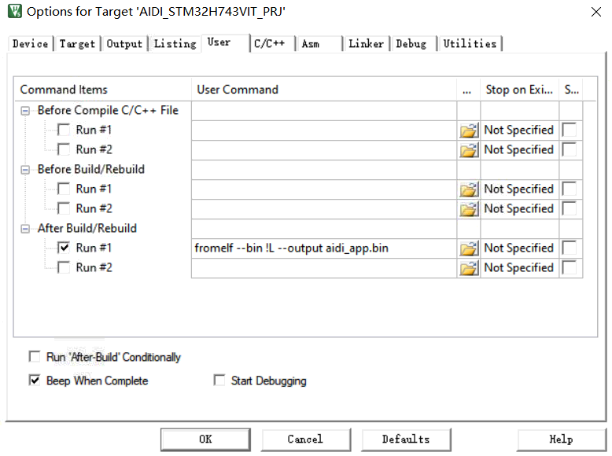

# STM32F103ZET6_Bootloader

## 项目结构

- Ymodem协议

- Bootloader引导

- LetterShell终端控制台

- AES注册加密

- SFUD万能驱动

- Easylog日志

- FATFS文件系统
- FAL分区
- FreeRTOS操作系统

## 调试问题

注意板子使用外部供电，供电不足会导致跑飞问题

# Bootloader框架

## 终端控制台预览


## flash分区

```c
         _       _   _    _____          _   _______                 _     
        (_)     | | (_)  / ____|        (_) |__   __|               | |    
  __ _   _    __| |  _  | (___     ___   _     | |      ___    ___  | |__  
 / _` | | |  / _` | | |  \___ \   / __| | |    | |     / _ \  / __| | '_ \ 
| (_| | | | | (_| | | |  ____) | | (__  | |    | |    |  __/ | (__  | | | |
 \__,_| |_|  \__,_| |_| |_____/   \___| |_|    |_|     \___|  \___| |_| |_|

Build:       Feb 14 2021 01:32:15
Version:     3.0.6
Copyright:   (c) 2021 aidiSciTech
/*在终端输入任意键停止引导倒计时，一开始没有输入的情况下3s倒计时时间，每输入时重置为30s倒计时*/
aidi:/$ Please press any key to stop bootloader, when 1 S later app jump.

/*倒计时时间到，读取当前使用的固件信息，检测为Wait Update时，说明固件已烧录APP分区，等待跳转，若成功跳转执行则APP程序修改flag为更新完成状态，否则每次bootloader会记录Wait Update的次数，超过设定出错次数，说明固件存在问题，自动使用factory分区固件进行恢复*/
firmware name: aidi_app.bin, size : 115840 Bytes, update flag:00AD6666 Wait Update.
                                                                
erase flag partition ...
[I/FAL] first erase page:14
[I/FAL] end erase page:15
[I/FAL] erase page:0x06,PAGES:2,BANK:2
[I/FAL] erase size:262144
write flag partition ok.

/*执行跳转APP分区阶段*/                                                                
read top address of stack : 24018C70
check stack in:24000000

/*以下为APP分区执行，输出*/                                                                
APP Ver:V1.0,stack addr:0x24018C70.
                                                                
[D/FAL] (fal_flash_init:63) Flash device |             stm32_onchip | addr: 0x08000000 | len: 0x00200000 | blk_size: 0x00020000 |initialized finish.
[I/FAL] ==================== FAL partition table ====================
[I/FAL] | name     | flash_dev    |   offset   |    length  |
[I/FAL] -------------------------------------------------------------
[I/FAL] | bl       | stm32_onchip | 0x00000000 | 0x00020000 |
[I/FAL] | app      | stm32_onchip | 0x00020000 | 0x00080000 |
[I/FAL] | download | stm32_onchip | 0x000a0000 | 0x00060000 |
[I/FAL] | factory  | stm32_onchip | 0x00100000 | 0x00080000 |
[I/FAL] | kv       | stm32_onchip | 0x00180000 | 0x00040000 |
[I/FAL] | flag     | stm32_onchip | 0x001c0000 | 0x00040000 |
[I/FAL] =============================================================
[I/FAL] Flash Abstraction Layer (V0.5.0) initialize success.
```

- bl：bootloader分区
- app：运行分区
- download：新固件下载区
- factory：出厂固件分区，当新固件运行存在问题，开机启动长按恢复按键，恢复至出厂固件
- kv：key-value键值对参数存储分区
- flag：升级标志存储区

## APP分区固件制作

### 设置中断向量表

在main入口加入以下代码

```c
/**
  ******************************************************************
  * @brief   中断向量表迁移
  * @param   [in]None
  * @return  None.
  * @author  aron566
  * @version V1.0
  * @date    2021-02-25
  ******************************************************************
  */
void User_InterruptVectorTable_Move(void)
{
  SCB->VTOR = (FLASH_BANK1_BASE+(128*1024));
}
```

### 设置flash起始地址


### 加入升级成功标识写入

在其他必须的初始化完成后，加入以下代码

```c
/**
 *  @file Update_Port.c
 *
 *  @date 2021-01-25
 *
 *  @author aron566
 *
 *  @copyright Copyright (c) 2021 aron566 <aron566@163.com>.
 *
 *  @brief 
 *
 *  @details 1、
 *
 *  @version V1.0
 */
#ifdef __cplusplus ///<use C compiler
extern "C" {
#endif
/** Includes -----------------------------------------------------------------*/
/* Private includes ----------------------------------------------------------*/
#include "Update_Port.h"
#include "Flash_Port.h"
#include "utilities.h"
/** Private macros -----------------------------------------------------------*/
#define FRIMWARE_NAME_LEN_MAX               64U       /**< 固件名称长度*/
#define REGISTER_CODE_LEN_MAX               (4*4U)    /**< 注册码长度Byte*/
#define FRIMWARE_FLAG_PARTITION_NAME        "flag"    /**< 升级标识分区名*/
#define CURRENT_FRIMWARE_SIZE               264*1024U /**< 本固件BIN大小*/

#ifndef SECTION
  #ifdef __CC_ARM                        /* ARM Compiler */
      #define SECTION(x)                 __attribute__((section(x)))
      #define USED                       __attribute__((used))
  #elif defined (__IAR_SYSTEMS_ICC__)    /* for IAR Compiler */
      #define SECTION(x)                 @ x
      #define USED                       __root
  #elif defined (__GNUC__)               /* GNU GCC Compiler */
      #define SECTION(x)                 __attribute__((section(x)))
      #define USED                       __attribute__((used))
  #else
      #error not supported tool chain
  #endif /* __CC_ARM */
#endif

/** Private typedef ----------------------------------------------------------*/
/*升级标识*/
typedef enum
{
  UPDATE_SUCESSFUL  = 0xAD8888,                       /**< 更新成功*/
  UPDATE_WAITTING   = 0xAD6666,                       /**< 等待更新*/
  DOWNLOAD_COMPLETE = 0xAD5555,                       /**< 下载完成*/
}FRIMWARE_UPDATE_FLAG_Typedef_t;

/*固件信息*/
typedef struct      
{     
  char FrimwareName[FRIMWARE_NAME_LEN_MAX];           /**< 固件名称*/
  uint32_t FrimwareSize;                              /**< 固件大小*/
  char BackFrimwareName[FRIMWARE_NAME_LEN_MAX];       /**< facotry固件名称*/
  uint32_t BackFrimwareSize;                          /**< facotry固件大小*/
  FRIMWARE_UPDATE_FLAG_Typedef_t Flag;                /**< 升级标识*/
  uint32_t Retry_Cnt;                                 /**< 等待更新次数累计*/
  uint32_t Register_Code[REGISTER_CODE_LEN_MAX/4];    /**< 注册码*/
}FRIMWARE_INFO_Typedef_t;

/** Private constants --------------------------------------------------------*/

/** Public variables ---------------------------------------------------------*/
/** Private variables --------------------------------------------------------*/
static FRIMWARE_INFO_Typedef_t Frimware_Info;
/** Private function prototypes ----------------------------------------------*/
static void Write_Frimware_Info(FRIMWARE_INFO_Typedef_t *Frimware_Info);
static void Get_Frimware_Info(FRIMWARE_INFO_Typedef_t *Frimware_Info);
/** Private user code --------------------------------------------------------*/

/** Private application code -------------------------------------------------*/
/*******************************************************************************
*
*       Static code
*
********************************************************************************
*/

/**
  ******************************************************************
  * @brief   写入固件信息
  * @param   [in]Frimware_Info 固件信息.
  * @return  None.
  * @author  aron566
  * @version v1.0
  * @date    2021/2/12
  ******************************************************************
  */
static void Write_Frimware_Info(FRIMWARE_INFO_Typedef_t *Frimware_Info)
{
  /*擦除信息*/
  printf("erase flag partition ...\r\n");
  Flash_Port_Erase_Partition(FRIMWARE_FLAG_PARTITION_NAME);
  Flash_Port_Write_Partition_Data(FRIMWARE_FLAG_PARTITION_NAME,
                              (uint8_t *)Frimware_Info, 0, sizeof(FRIMWARE_INFO_Typedef_t));
  printf("write flag partition ok.\r\n");
}

/**
  ******************************************************************
  * @brief   获取固件信息
  * @param   [out]Frimware_Info 信息存储区.
  * @return  None.
  * @author  aron566
  * @version v1.0
  * @date    2021/2/11
  ******************************************************************
  */
static void Get_Frimware_Info(FRIMWARE_INFO_Typedef_t *Frimware_Info)
{
  int ret = Flash_Port_Read_Partition_Data(FRIMWARE_FLAG_PARTITION_NAME, 
                              (uint8_t *)Frimware_Info, 0, sizeof(FRIMWARE_INFO_Typedef_t));
  if(ret < 0)
  {
    printf("get frimware info faild.\r\n");
  }
  Frimware_Info->FrimwareName[FRIMWARE_NAME_LEN_MAX-1] = '\0';
  printf("\r\nfirmware name: %s, size : %u Bytes, update flag:%08X ", Frimware_Info->FrimwareName
        ,Frimware_Info->FrimwareSize, Frimware_Info->Flag);
  switch(Frimware_Info->Flag)
  {
    /*更新成功*/
    case UPDATE_SUCESSFUL:
      printf("App Frimware Ok.\r\n");
      break;
    /*等待更新*/
    case UPDATE_WAITTING:
      printf("Update Frimware Ok.\r\n");
      break;
    default:
      printf("Unknow flag.\r\n");
      strncopy(Frimware_Info->FrimwareName, "Factory_APP.bin", FRIMWARE_NAME_LEN_MAX);
      strncopy(Frimware_Info->BackFrimwareName, "Factory_APP.bin", FRIMWARE_NAME_LEN_MAX);
      Frimware_Info->FrimwareSize = Frimware_Info->BackFrimwareSize = CURRENT_FRIMWARE_SIZE;
      break;
  }
}

/** Public application code --------------------------------------------------*/
/*******************************************************************************
*
*       Public code
*
********************************************************************************
*/
/**
  ******************************************************************
  * @brief   获取固件名
  * @param   [in]None.
  * @return  固件名.
  * @author  aron566
  * @version v1.0
  * @date    2021/03/01
  ******************************************************************
  */
const char *Update_Port_Get_Frimware_Name(void)
{
  return Frimware_Info.FrimwareName;
}

/**
  ******************************************************************
  * @brief   获取固件大小
  * @param   [in]None.
  * @return  固件大小字节.
  * @author  aron566
  * @version v1.0
  * @date    2021/03/01
  ******************************************************************
  */
uint32_t Update_Port_Get_Frimware_Size(void)
{
  return Frimware_Info.FrimwareSize;
}

/**
  ******************************************************************
  * @brief   写入下载成功标识
  * @param   [in]None.
  * @return  None.
  * @author  aron566
  * @version v1.0
  * @date    2021/03/24
  ******************************************************************
  */
void Update_Port_Write_Download_Complete_Flag(void)
{
  /*擦除信息*/
  printf("erase flag partition ...\r\n");
  Flash_Port_Erase_Partition(FRIMWARE_FLAG_PARTITION_NAME);
  Frimware_Info.Flag = DOWNLOAD_COMPLETE;
  Flash_Port_Write_Partition_Data(FRIMWARE_FLAG_PARTITION_NAME,
                              (uint8_t *)&Frimware_Info, 0, sizeof(FRIMWARE_INFO_Typedef_t));
  printf("write download complete flag partition ok.\r\n");  
}

/**
  ******************************************************************
  * @brief   写入新固件信息
  * @param   [in]Frimware_Name 固件名.
  * @param   [in]Size.
  * @param   [in]Partition_Name 分区名.
  * @return  None.
  * @author  aron566
  * @version v1.0
  * @date    2021/03/01
  ******************************************************************
  */
bool Update_Port_Write_New_Frimware_Info(const char *Frimware_Name, uint32_t Size, const char *Partition_Name)
{
  if(Frimware_Name == NULL || Size == 0)
  {
    return false;
  }
  
  /*检测写入大小*/
  if(Flash_Port_Get_Partition_Size(Partition_Name) < Size)
  {
    return false;
  }
  if(strncmp(Partition_Name, "download", FRIMWARE_NAME_LEN_MAX) == 0)
  {
    strncpy(Frimware_Info.FrimwareName, Frimware_Name, FRIMWARE_NAME_LEN_MAX);
    Frimware_Info.FrimwareSize = Size;
    Frimware_Info.Flag = UPDATE_WAITTING;
    Frimware_Info.Retry_Cnt = 0;
  }
  else if(strncmp(Partition_Name, "factory", FRIMWARE_NAME_LEN_MAX) == 0)
  {
    strncpy(Frimware_Info.BackFrimwareName, Frimware_Name, FRIMWARE_NAME_LEN_MAX);
    Frimware_Info.BackFrimwareSize = Size;
  }
  else
  {
    return false;
  }
  /*写入*/
  Write_Frimware_Info(&Frimware_Info);
  return true;
}

/**
  ******************************************************************
  * @brief   更新初始化
  * @param   [in]None.
  * @return  None.
  * @author  aron566
  * @version v1.0
  * @date    2021/2/26
  ******************************************************************
  */
void Update_Port_Init(void)
{
  /*判断标识*/
  Get_Frimware_Info(&Frimware_Info);
  
  if(Frimware_Info.Flag == UPDATE_SUCESSFUL)
  {
    return;
  }
  
  /*写入更新成功标识*/
  Frimware_Info.Flag = UPDATE_SUCESSFUL;
  Write_Frimware_Info(&Frimware_Info);
}

#ifdef __cplusplus ///<end extern c
}
#endif
/******************************** End of file *********************************/

```


### 生成可烧写bin文件

键入以下命令

```bash
fromelf --bin !L --output aidi_app.bin
```




## 固件升级与上载

支持协议：YMODEM，其他自定义，支持ymodem协议传输的软件：`SecureCRT`


### 更新固件

```bash
#启动接收命令格式：upgrade 协议 分区名
upgrade ymodem download
upgrade ymodem factory
```

使用固件更新命令将固件下载至指定分区，当下载成功转到下一步将已下载固件更新至app分区（==只有将固件更新到download分区才会执行固件更新==）

当成功迁移新固件到app分区，则转到下一步跳转app分区执行，app分区跳转成功，应当将flag置为`0xAD8888`更新成功标识。否则再次重启Bootloader将检测更新成功标识，进行累计，超过指定次数，执行固件恢复（从factory分区恢复固件到app分区）。

==所以app分区的软件应当做好升级成功的标识写入==。

### 上载固件

```bash
#上载固件到本地命令格式：upload 协议
upload ymodem
```

## 升级方式

- 成品阶段：通过手机蓝牙连接发送固件升级指令
- 出厂阶段：默认串口连接设备，烧录并注册设备(软件加密)

## 设备注册方式

BL使用**AES256 CBC方式加密**

IV:ABCDEFGHIJK01234

KEY:aidiscitech20210222@@=?@20358008

网络在线工具：http://tool.chacuo.net/cryptaes/


### 设备未注册时终端控制台输出

```
Please Write Command: the "READ UID" or "READ REGISTER STATUS"first and write the "WRITE REGISTER CODE" at after.
```

发送`READ REGISTER STATUS`读取注册状态

这时需要发送字符串：==READ UID==

读取设备UID，使用提供的IV和KEY进行加密

再次对设备发送字符串：==WRITE REGISTER CODE C4 65 73 6D C5 2D C0 6E E1 96 C0 E0 9A 38 8C 22==

以上WRITE REGISTER CODE后面的数字及字母代表16进制0x73，只不过需要转为字符串发送给设备，每个16进制字符之间存在空格！

### 设备注册成功时输出

```
Congratulations Verification PASS!
```